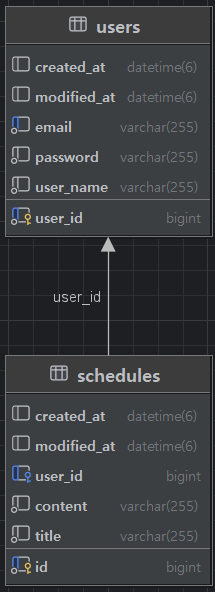

# 일정 관리 API

## 프로젝트 소개

Spring Boot를 이용한 일정 관리 API입니다.
필수기능 4단계까지 구현하였습니다.

어려웠던 점은 로그인 세션부분에서 구조 흐름들이 조금 어려웠습니다.
처음에는 서비스에서 세션까지 의존하는 코드에서
서비스는 세션은 모르고 유저id만 알도록 리팩토링하였습니다. 

일정 조회 및 전체조회는 로그인한 유저 일정만 나오도록 하였습니다.

---

## 개발 환경

- Java 17
- Spring Boot
- Spring Data JPA
- MySQL
- Gradle

---

## 기능

- 회원가입
- 로그인(Session)
- 로그아웃
- 일정 생성
- 일정 조회
- 일정 수정
- 일정 삭제

---

## ERD

---

## API 명세

https://documenter.getpostman.com/view/55295001/2sBY4Jy3x8

## Update 계획

- 다양한 예외처리
- 비밀번호 암호화
- 댓글 CRUD
- 일정 페이징 조회
